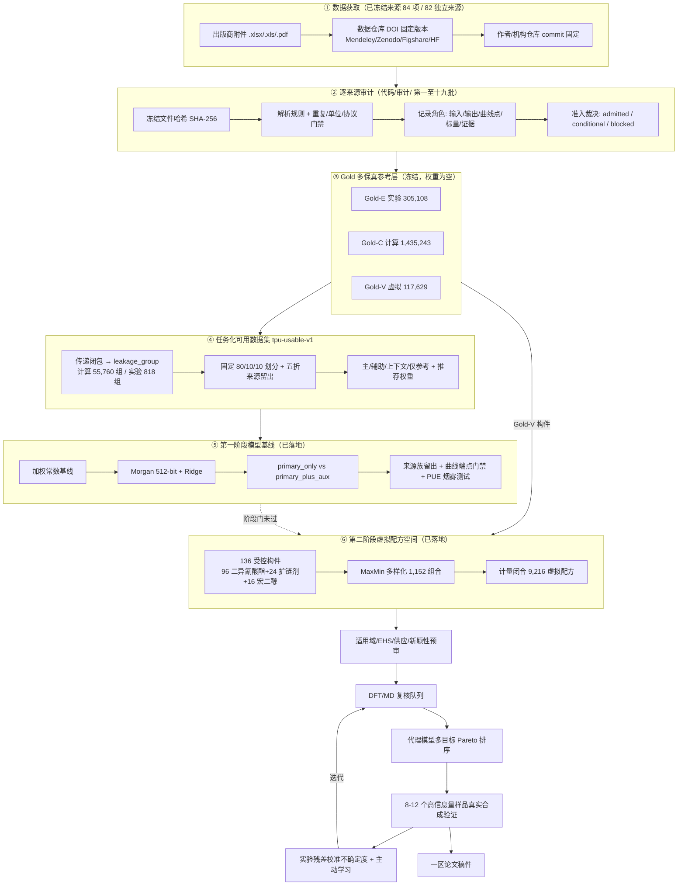
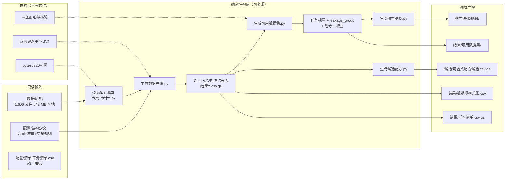

# TPU 高通量筛选项目总览

> 本文档系统介绍 TPU 文件夹中的**已有工作**与**后续工作**，包括项目目标、技术栈、数据架构、核心流程、当前进度与论文级路线图。文末附 mermaid 流程图。
>
> 初始文档基准：2026-07-30；现实库量化进度更新至2026-08-25。私人仓库 [fafasco16/TPU-HighThroughput-Screening](https://github.com/fafasco16/TPU-HighThroughput-Screening)。提交号和工作树状态以实际Git检查为准，不在长期文档中声称固定为“干净”。

---

## 1. 项目目标

一句话定位：**用 DFT + MD 等传统计算方法 + 机器学习交叉融合，高通量筛选出未有人研究过、高性能、有应用前景的 TPU/TPUU 体系，并真实合成验证**，工作成熟度对标一区论文。

更具体的研究主线已经收敛为：

> 线性分段 TPU 的"时序耗散—延迟有序化"高通量筛选——在真正可加工的线性 TPU 边界内，寻找低应变靠竞争氢键/链段滑移耗散、高应变靠硬段连通或应变诱导有序化承载的体系。

模型需同时约束：韧性、循环恢复、DMA、黏度、Tg、热稳定性、EHS 和成本。差异化创新点（区别于已有的小分子结合能映射、MD+可解释 ML、超大虚拟空间筛选、小样本主动学习）落在：

- TPU 分段配方图表示；
- 动态氢键交换与相分离形貌；
- 加工窗口与循环疲劳硬约束；
- 多保真不确定度校准；
- 8–12 个高信息量样品的真实合成验证。

---

## 2. 技术栈

### 2.1 语言与运行环境

| 类别 | 选型 | 说明 |
|---|---|---|
| 语言 | Python 3.11（`requires-python = ">=3.11,<3.13"`） | 全部代码与审计脚本 |
| 包管理 | `uv` + `pyproject.toml` + `uv.lock` | 可复现锁定依赖 |
| 测试 | `pytest >=8,<10` + `pytest-cov` | `代码/测试/`，覆盖率门槛 `fail_under = 90` |
| 代码规范 | Ruff | `代码/测试` 全量 lint |
| 版本管理 | Git + GitHub CLI（`gh`） | 私人仓库，仅上传代码/配置/文档/必要结果 |
| 平台 | Windows 11 + PowerShell | 脚本入口为 `.ps1`/`python` |

### 2.2 核心依赖库

```toml
pandas >=2.2,<3       # 长表读写、分组、聚合
pyarrow >=17,<22      # Parquet/Arrow 列式存储
duckdb >=1.2,<2       # SQL 查询大型 CSV.gz，无需预加载
openpyxl >=3.1,<4     # 解析出版商 .xlsx/.xls 附件
pypdf >=6,<7          # 解析论文 PDF 正文/SI
PyYAML >=6,<7         # 配置与合同三件套
rdkit >=2026.3        # 规范 SMILES、InChIKey、Morgan 指纹、Tanimoto
```

### 2.3 计算与建模方法栈（科学侧，部分为规划）

| 层 | 方法/工具 | 当前状态 |
|---|---|---|
| DFT / AIMD | Psi4、ωB97M-D3BJ/6-31G(d,p)、RESP、冻结二面角 | 小片段RESP与8/8训练松弛点已完成；两个外部片段六角度DFT运行中；现实配对r2SCAN-3c仍因无授权ORCA阻断 |
| 半经验 / TDDFT | CREST 3.0.2、GFN2-xTB 6.7.1 | 虚拟库83构件/30,647构象与现实库19构件均已形成系综描述符；不把xTB代理写成DFT或实验性能 |
| 经典 MD / NEMD | RadonPy、GAFF2、LAMMPS | 单链及396原子双链执行烟雾通过；RESP核心、扭转候选和现实链映射已审计，生产MD仍被外部片段、电荷补全及凝聚相对照阻断 |
| 粗粒化 MD (CGMD) | 10 个 CG 材料体系（第15批） | 已纳入 Gold-C，输入/输出分角色保存 |
| 反应 CFD / PBE | OpenFOAM、QMOM、mixing-cup（PUFoam） | 已纳入 Gold-C，9,014 条过程数值 |
| 有限元 (FEA) | Abaqus/ANSYS 直接求解 | 已纳入准入规则；ML 代理输出归 Gold-V |
| 多保真建模 | Kennedy & O'Hagan / Perdikaris 线性/非线性多保真框架 | 设计为论文主模型（方案 C），当前 `not_established` |
| 机器学习基线 | 加权常数 + 512-bit Morgan 指纹 Ridge | 第一阶段已落地，96 行指标 |
| 候选空间生成 | 规则枚举 + SMiPoly/PolyUniverse 反应模板 + MaxMin 多样化 | 第二阶段已落地，136 构件 / 1,152 组合 / 9,216 配方 |

### 2.4 数据工程栈

- **分层存储**：`数据/{原始,暂存,派生,规范,快照}` + `结果/` 冻结 Gold 层；大文件仅本地，不上传 GitHub（单文件 95 MiB 门禁，避开 100 MB 限制）。
- **身份系统**：UUID5（命名空间固定）+ InChIKey 连接度族 + SHA-256 文件哈希 + 逻辑哈希（`tpu-logical-hash/1`），保证跨快照稳定与可复现。
- **合同三件套**：`v0.2来源治理合同.yaml`（schema）+ `v0.2枚举.yaml` + `v0.2质量规则.yaml`，三者哈希写入快照，冻结后不可变。
- **双构建验证**：两次隔离构建产物逐字节一致 + 逻辑哈希一致，作为可复现性硬门。

---

## 3. 数据架构（已有工作核心）

### 3.1 Gold 多保真分层

项目的 Gold **不是**一张只有 SMILES + 拉伸强度的表，而是五类信息通过稳定 ID 连接的多保真参考库：

| 子集 | 内容 | 当前规模 | 用途 |
|---|---|---:|---|
| `Gold-E` | 真实合成/制样/测试的 TPU/TPUU 数据 | 305,108 条 | 性能标定、最终验证 |
| `Gold-C` | 可靠可复现的 DFT/AIMD/MD/NEMD/CGMD/CFD-PBE/FEA/COSMO-SAC | 1,435,243 条 | 机理特征、过程窗口、预训练、低保真标签、复筛 |
| `Gold-V` | 来源可靠、结构可解析、生成/预测身份明确的虚拟候选 | 117,629 条 | 扩大化学空间、主动学习、候选排序 |
| `Gold-E+Gold-C` | 来源级聚合（同源同时含实验+计算） | 369 行 | 模拟偏差校准 |

**关键原则（"宽准入、严标注"）**：

- 进入 Gold 参考范围 ≠ 作为高权重真值训练。科学准入、训练权重、适用域、再分发权利是**四个独立维度**。
- 准入状态三档：`admitted_reference`（正式参考）/ `conditional_reference`（条件参考，协议/单位/映射待补）/ `blocked`（阻断）。
- 缺字段只限制对应任务，不整源删除；真正拒绝的是来源/体系/方法不明，或把预测值伪装成实验真值。
- **行数 ≠ 材料数；模拟 ≠ 实验；虚拟候选 ≠ 已可合成。**

### 3.2 一条筛选记录的五个部分

最终可训练的一行必须通过稳定 ID 闭合：

1. **候选结构**：组分 SMILES、规范 SMILES、InChIKey、官能度、候选角色、生成规则；
2. **配方计量**：异氰酸酯/多元醇/扩链剂、NCO/OH、硬段含量、Mn/Mw/PDI、添加剂；
3. **合成与加工**：路线、催化剂、温度、时间、含水量、退火、成型条件；
4. **性能与条件**：实验/DFT/MD/预测数值 + 单位、温度、应变率、方法、不确定度；
5. **血缘与质量**：DOI/URL、版本、文件哈希、许可证、Gold 层、准入状态、泄漏组、权重上限。

当前最大缺口不是"行数少"，而是**结构—配方—工艺—性能的闭合率仍低**（约 40%），`model_ready_record_count = 0`。

### 3.3 任务化可用视图（`结果/可用数据集/`，发布版 `tpu-usable-2026-07-21-v1`）

为避免直接对冻结参考长表逐行随机训练，单独发布一层任务化视图：

| 文件 | 行数 | 用途 |
|---|---:|---|
| `候选结构.csv.gz` | 117,629 | 构件/重复单元/迁移候选；110,807 通过结构级排序门 |
| `计算观测.csv.gz` | 1,435,243 | 计算长表，区分主监督/辅助/上下文/仅参考 |
| `实验观测.csv.gz` | 305,108 | 实验标量/曲线点/配方工艺上下文 |
| `曲线索引.csv` | 201 | 一条曲线一行，不把 299,448 点当独立样本 |
| `任务清单.csv` | 6 | 六类任务就绪行数与限制 |
| `来源与引用.csv` | 27 | 实际使用来源的 DOI/许可证/引用键 |
| `字段字典.csv` / `发布清单.json` | — | 字段定义 + 输入输出 SHA-256 |

六类任务：`候选_结构排序`、`计算_结构多任务预训练`、`计算_过程代理模型`、`实验_曲线建模`、`实验_标量校准`、`上下文_仅作输入`。

防泄漏划分：先把规范结构族、`simulation_key`、`curve_id`、`sample_id`、`formulation_id`、来源内材料族做**传递闭包**生成 `leakage_group`（计算层 55,760 组、实验层 818 组），再固定哈希为 80/10/10 开发划分 + 五折来源族留出。**禁止逐点随机拆分。**

权重公式：

```text
recommended_loss_weight = potential_weight_ceiling
                        × quality_factor
                        × role_factor
                        × independence_weight
```

同一曲线的点、同一模拟同一性质的重复值共享一个总预算；`source_balanced_sampling_probability` 防止 OMG/PolyOmics 等大来源仅凭行数主导。

---

## 4. 核心代码与流程

### 4.1 代码组织

```text
代码/
├── 生成数据总账.py        # v0.2 权威入口：复算 Gold-V/C/E 视图与样本清单
├── 生成可用数据集.py      # 从冻结 Gold 生成任务化发布视图（划分+权重）
├── 生成模型基线.py        # 第一阶段 Ridge 基线 + 曲线端点 + PUE 烟雾测试
├── 生成候选配方.py        # 第二阶段虚拟配方空间（构件→组合→计量闭合）
├── run_pipeline.py        # 历史 v0.1 四源管道（仅兼容，不用于重建权威总账）
├── adapter_*.py           # 四个 v0.1 适配器（hbond/pue326/smipoly/viscosity）
├── schema.py / contract.py / ids.py / units.py / qc.py / ...
├── 审计/                  # 逐来源可复现审计脚本（第一至第十九批，约 40 个）
├── 获取/                  # 数据下载脚本
└── 测试/                  # pytest，含夹具与逐批回归测试
```

权威产物（不要混用 v0.1 口径）：

- `结果/数据规模总账.csv`、`结果/样本清单.csv.gz`
- `结果/Gold_V_候选.csv.gz`、`结果/Gold_C_计算性能.csv.gz`、`结果/Gold_E_实验表格.csv.gz`
- `结果/可用数据集/`（任务视图）、`候选/`（虚拟配方）、`模型/基线结果/`（基线）

### 4.2 运行命令

```powershell
uv sync --extra dev
uv run python 代码\生成数据总账.py        # 复算 Gold 参考层
uv run python 代码\生成可用数据集.py      # 生成任务化发布视图
uv run python 代码\生成可用数据集.py --检查   # 核验 SHA-256，不写文件
uv run python 代码\生成模型基线.py        # 第一阶段基线
uv run python 代码\生成候选配方.py        # 第二阶段候选空间
uv run pytest 代码\测试 -q               # 全量测试
```

### 4.3 总体流程（mermaid）



---

## 5. 当前进度（已有工作总结）

### 5.1 已完成

| 维度 | 状态 |
|---|---|
| 数据治理框架 | 约 85% 成熟：分层存储、合同三件套、双构建验证；最近一次完整套件1,376项通过、7项因本机无PyTorch跳过，新增模块另有定向测试 |
| 来源规模 | 84 个范围项 / 82 个独立来源（第一至十九批，含 PUFoam、PolyOmics、OMG、RadonPy、PolyUniverse、DRUM-TPUU、IIR-OH、再生泡沫等） |
| Gold 参考层 | Gold-E 305,108 / Gold-C 1,435,243 / Gold-V 117,629，权重全空 |
| 任务化视图 | `tpu-usable-2026-07-21-v1`：1,592,905 任务级观测 + 110,807 可排序候选 |
| 第一阶段基线 | 4 个 primary 目标（Rg/density/bulk_modulus/thermal_conductivity）达标；density 测试 R²=0.829，thermal_conductivity R²=0.565 |
| 第二阶段候选 | 136 构件 / 1,152 组合 / 9,216 计量闭合虚拟配方 |
| 现实商业库 | 19个规划构件：7个二异氰酸酯、5个PTMG商品牌号、7个扩链剂；245个三构件体系、980个计量配方 |
| 现实离散构件量化 | 14/14完成CREST 3.0.2；1,445个构象完成xTB 6.7.1，0失败；14行构件系综描述符 |
| PTMG代表链量化 | PTMG-650/1000/1400/1800/2000各1个确定性低聚链代理完成xTB，0失败；明确禁止解释为商品分布 |
| 现实配方量化筛选 | 19构件闭合到980条配方；336条Pareto配方对应84个基础体系；40条DFT/MD复核队列覆盖全部19个构件 |
| 虚拟构件量化 | Slurm终态83个严格完成、2个输入阻断、1个续算中；阶段83含30,647个xTB构象、0失败，48条配方中44条阶段可用、28条位于第一前沿 |
| 现实MD参数化 | 12条整数计量/二维图/三维种子；四家族三构象联合RESP；DFT/MM松弛8/8；134个目标扭转映射为77脂肪+57芳香、211条候选周期项；生产门仍关闭 |
| 实验闭环准备 | 6体系短名单、6行批次模板和48行测量模板已冻结；全部等待真实报价、SDS/CoA、OH值/水分和本单位审批，尚无合成数据进入Gold-E |
| GNN结构基线 | 26,176个图样本、4个计算性质目标；内部测试均优于Morgan-Ridge，但980条现实配方全部在当前结构域外，性能外推关闭 |
| 严格实验核心 | 30 个配方、27 个批次、217 条键控曲线、913,608 个审计点 |
| 可复现性 | 两次隔离构建逐字节一致；逻辑哈希冻结 |
| 引用链路 | `文档/数据来源与参考文献.md`，连续编号参考文献台账 |

### 5.2 第一阶段基线关键结论

- **内部测试集**：`primary_plus_aux` 相对加权常数基线稳定改善（density RMSE 降低 58.8%，thermal_conductivity 降低 34.4%）。
- **来源外推**：仅 Rg/Open Polymer Challenge 满足留出门槛，**R² 仍为负** → 第一阶段模型**不能**直接承担跨来源发现任务。
- **多保真增益**：`not_established`，Gold-C 与 Gold-E 间无足够闭合的同结构—配方—工艺成对映射。
- **曲线端点**：201 条曲线索引，79 条通过物理端点门禁，98 条因轴语义/单位未闭合仅留血缘。

### 5.3 整体完成度

约 **40%**。数据工程、现实商业配方空间、构件级CREST/xTB、预反应代理、RESP及扭转参数训练层已经形成；决定论文质量的外部参数验证、生产级配方MD、实验性能模型、真实合成与闭环校准仍未完成。该比例是项目管理估计，不是论文成熟度评分。

---

## 6. 后续工作（路线图）

按时间顺序，分六个阶段：

### 阶段一：闭合结构—配方—工艺—性能映射（约 3–7 工作日）

1. 从 8,365 个线性 TPU 干净构件中，形成满足反应规则、计量、EHS、可采购约束的完整配方；
2. 把 Gold-C 与 Gold-E 映射到共同 `candidate_id/formulation_id`，优先闭合力学、热性能、耐久链；
3. 建立第一版多任务 + 多保真基线（方案 C：共享编码器 + 任务/保真度独立输出头 + 偏差校准）。

### 阶段二：多保真主模型训练（数据库冻结后 3–6 周）

- 通用聚合物模拟预训练 → PU/TPU 子领域迁移 → DFT/MD/实验多任务联合 → 末段仅实验微调；
- 用实验残差校准不确定度；每个"性质×保真度"单独归一化损失；
- 保留方案 A（单模型混合）和方案 B（模拟预训练→实验微调）作消融基线。

### 阶段三：候选复筛与 DFT/MD 复核（2–4 个月）

- 在 9,216 虚拟配方上做适用域、商业可得性、EHS、文献新颖性预审；
- 建立 DFT/MD 复核队列（氢键能、构象能、反应活性、片段描述符；氢键寿命、相分离、链段迁移率、内聚能密度）；
- 代理模型多目标 Pareto 排序，收缩到 100–300 候选 → 再到 8–12 个高信息量样品。

当前已把现实库收缩为40条DFT/MD队列、12条高层覆盖子集和6条实验短名单。构件与小片段层的CREST/xTB、预反应、RESP和扭转训练已执行；完整链生产MD仍必须等待外部扭转验证、整链电荷和凝聚相商业对照门。

### 阶段四：真实合成与表征（8–16 周）

- 首轮合成 6–8 个候选 + 2 个基准体系；
- 完整应力—应变、循环、DMA、流变、Tg、热稳定性表征；
- 根据结果做一轮主动学习，避免疯狂做实验。

### 阶段五：迭代优化（如需，6–10 周）

- 实验残差回灌，重新优化配方；
- 更新模型与候选队列。

### 阶段六：论文（合计 5–8 个月，稳妥 6–10 个月，不含审稿）

- 数据集发布、模型开源、合成验证闭环；
- 引用按实际使用子集生成，不笼统引用整个数据库。

### 关键纪律（贯穿全程）

- 不逐行随机切分同一结构/曲线/配方；
- 不把曲线点数当独立材料数；
- 不把 Gold-C 模拟值写成 Gold-E 实验真值；
- 不把 PUE 对数目标逆变换后宣称物理单位；
- 不从重复单元 SMILES 直接宣称已表示完整配方/分子量/工艺；
- 不只挑较好指标而隐藏常数基线、失败门禁或来源留出负结果。

---

## 7. 关键文件索引

| 入口 | 路径 |
|---|---|
| 项目说明 | `README.md` |
| Gold 定义 | `文档/Gold数据集定义.md` |
| 当前数据状态 | `文档/当前数据状态.md` |
| 数据来源与参考文献 | `文档/数据来源与参考文献.md` |
| 持续优化计划 | `文档/数据库持续优化计划.md` |
| 第一阶段模型说明 | `模型/README.md` |
| 基线报告 | `模型/基线结果/基线报告.md` |
| 可用数据集说明 | `结果/可用数据集/README.md` |
| 第二阶段候选说明 | `候选/README.md` |
| 现实筛选与实验短名单 | `结果/现实筛选/筛选报告.md`、`结果/现实筛选/实验短名单/` |
| DFT/MD分层协议 | `文档/DFT_MD复核协议.md` |
| 扭转外部验证计划 | `文档/扭转参数外部验证计划.md` |
| 现实MD参数门 | `计算/现实MD/参数验证/生产参数门说明.md` |
| 商业对照MD预注册 | `文档/商业对照生产MD预注册协议.md`、`计算/现实MD/商业对照MD计划/` |
| 模型—实验闭环 | `结果/现实筛选/实验短名单/模型实验闭环/` |
| 候选配方字段说明 | `文档/候选配方字段说明.md` |
| 代码入口 | `代码/README.md` |
| 来源治理合同 | `配置/结构定义/v0.2来源治理合同.yaml` |
| 基线配置 | `模型/配置/基线配置.yaml` |

---

## 8. 数据流时序（mermaid）

下图聚焦从原始文件到可训练样本的确定性数据流：



---

## 9. 论文级目标的三句话边界

1. **现在有什么**：可审计多保真数据底座、分离的虚拟/现实库、83构件虚拟量化、19构件现实量化、12条现实MD结构与参数候选、6体系实验短名单。
2. **现在没什么**：还没有跨来源可外推的宏观性能发现模型，没有通过生产参数门的完整链MD，也没有真实合成批次进入Gold-E。
3. **下一步做什么**：完成外部扭转与任务84 → 整链电荷/凝聚相对照 → 生产级MD与不确定度排序 → 真实采购合成验证 → 实验残差校准与论文。
